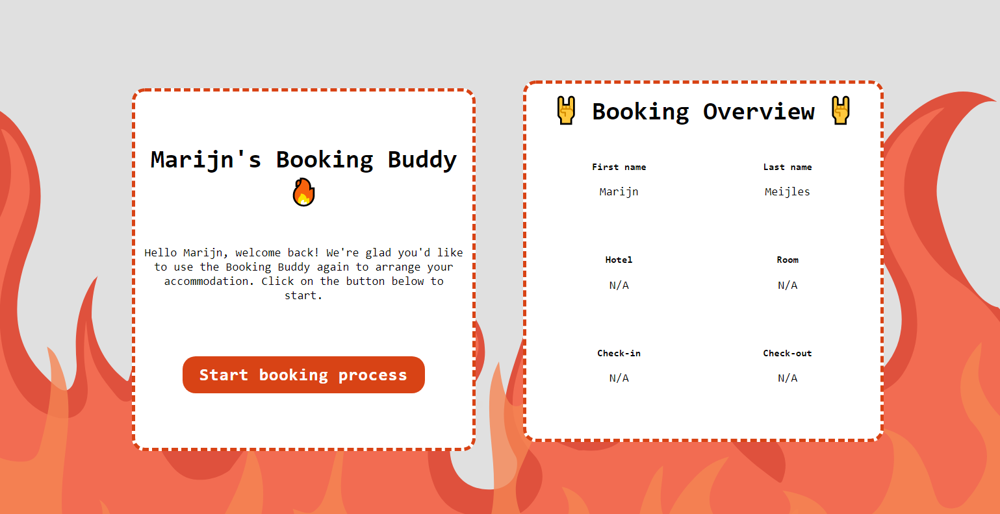
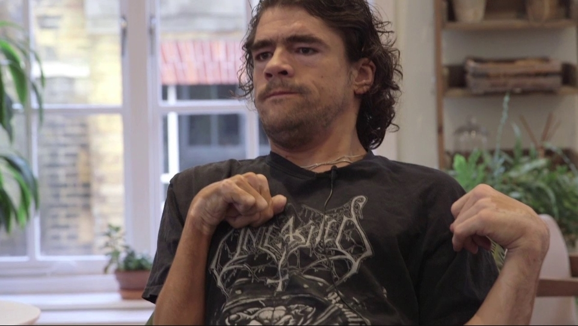
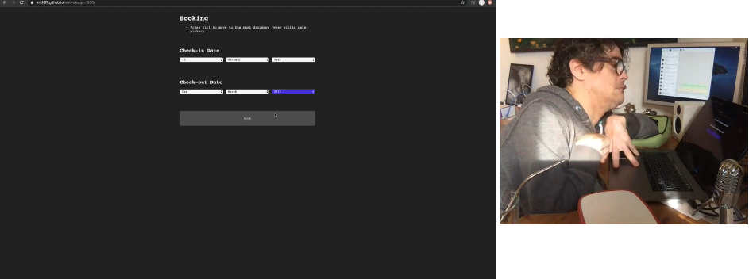
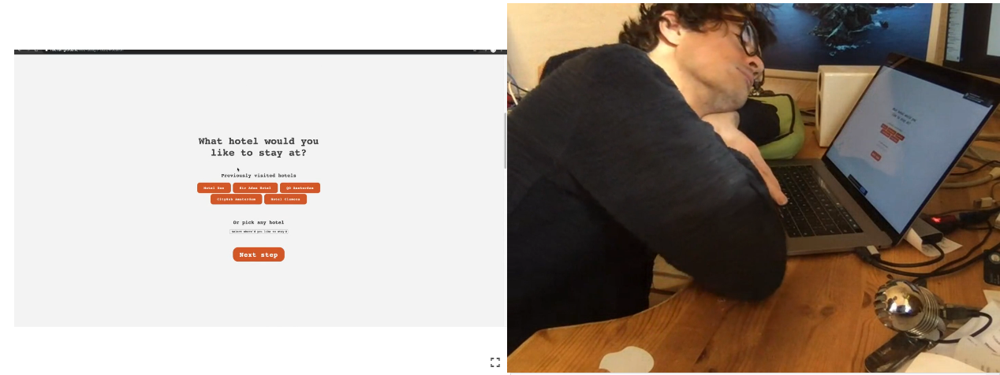

# WD1920 | Marijn's Booking Buddy

## Description
The Booking Buddy is an application specifically made for Marijn Meijles with the help of the [Exclusive Design Principles](https://exclusive-design.vasilis.nl/) written by Vasilis van Gemert. The Booking Buddy is a hotel booking applcation divided in parts giving the ability to pick from a hotel, room, check-in and check-out date. It has been designed to be as accessible as possible exclusively for Marijn.

[Live Demo](https://mich97.github.io/web-design-1920/)

## Table of contents

- [Meet Marijn Meijles (User Scenario)](#meet-marijn-meijles-user-scenario)
- [Exclusive design principles](#exclusive-design-principles)
    - [Study situation](#study-situation)
    - [Ignore conventions](#ignore-conventions)
    - [Prioritise identity](#prioritise-identity)
    - [Add nonsense!](#add-nonsense)
- [User tests](#user-tests)
    - [Test 1](#test-1)
        - [Interview results](#interview-results)
    - [Test 2](#test-2)
    - [Test 3](#test-3)
- [Credits](#credits)

## Meet Marijn Meijles (User Scenario)

This application is made specifically for Marijn Meijles, Marijn is a developer who loves metal music with a motoric disorder which weakens his muscles. As you can imagine this could make certain things difficult for Marijn. To be more specific, things that require accuracy/precision in movements can be challenging.

It's the start of the week and Marijn has to go to Amsterdam as usual for work. As he lives pretty for away from Amsterdam (Eindhoven) he's gonna want to book a 1 night stay in a hotel.

Marijn opens the application and right away gets instructions on how to start. Cause Marijn has used the application before there are already some defaults he can pick, he picks his usual hotel/room-type and continues. Next up Marijn picks the day he wants to check-in for. Cause the application knows that Marijn normally stays 1 night it suggest the very next day to be the check-out date. Perfect!

All the details get filled in an overview which already had some exclusive presets for Marijn.

## Exclusive design principles
Here we will be looking at the principles of exclusive design.

### Study situation
The first step we took as a group was to do research about Marijn before asking him any questions we had to be prepared. By browsing repositories from last year we were able to find a bunch of information, like:

- Marijn is a father, software engineer and a huge metal lover!
- Likes to joke around a lot and has no trouble speaking his mind
- Uses 1 hand (left) to use keyboard/trackpad
- He prefers to use keys which are close to eachother e.g. arrow keys
- Barely uses tab

### Ignore conventions
As this is not a normal situation we need to ignore conventions to make a datepicker as accessible as possible. Rather than having a normal input type date I went with being able to pick an upcoming day or pick a date by selecting a day/month from dropdowns which are much more accessible for Marijn. I made sure nothing requires too much precision in movement.

### Prioritise identity
Haivng user tests with Marijn helped a lot in prioritising his identity. I noticed Marijn is very straight to the point and doesn't like anythings that's unneeded so I decided to go with a simple/flat design for tha application without unnecessary stuff and minimal colours.

### Add nonsense!
Marijn loves metal music so the nonsense I added is mostly based from his taste in music. There is fire in the background to give it a metal-feel and there are nonsense emojis all over the application.

## User tests
The user tests were done in a group call with all the other students from Marijn's team, so conveniently some information may have been used from other tests.

### Test 1
The first test we did as a group, we prepared some questions and 1 person made a general test application. To give a general idea on how Marijn uses it.

#### Interview results
- Marijn's way of using his computer 
Uses Enter, Shift, and arrow keys a lot. Has thumb on his trackpad, rarely uses tab and also has on sticky keys

- OS/Browser 
Normally on Chrome and sometimes Safari, has a Mac (OSX) and an iPhone XS (IOS)

- Datepicker issues 
"That's your job to find out!"

- Tip from Marijn 
Make use of him being a programmer, it may be nerdy/technical!

- Typical web issues 
Lots of applications are difficult to use cause most aren't made with keeping in mind accessibility for Marijn's needs

### Test 2

In the second test the very first prototype was tested, see picture above. I wanted Marijn to try out picking a date from dropdowns, here I noticed that it went pretty good without having any extra controls. During the test I also found out that Marijn rather wouldn't have ctrl as a separate control cause it becomes a hassle with sticky keys turned on.

I decided to not use ctrl as a navigating key and remove the function completely cause it wasn't needed at all.

### Test 3

This was the last test I had with Marijn, see picture above. I had pepared some questions to make sure all his wishes for the application were fulfilled.

- How do you like the overall process and styling? 
Marijn seemed to like how steps were individually placed but didn't like how you could still scroll from one to the other step. He mentioned that he liked the simple styling.

- What are some of the defaults I could use? 
He mentioned that he always stays in the same hotel, for 1 night usually all by himself.

Concluded changes I could make to the application:
- Fix not being able to scroll from one to another step
- If a day is chosen, show the next day in checkout as a suggestion
- Defaults are: 1 same hotel and 1 person room

## Credits
- Marijn Meijles for testing and participating in this great project!
- Team Marijn for working together/sharing found information
- Web Design lectures and involved teachers/guests
- Vasilis for driving down to Eindhoven for the tests
- [Used fire animation](https://codepen.io/tahina/pen/WRXNwQ)